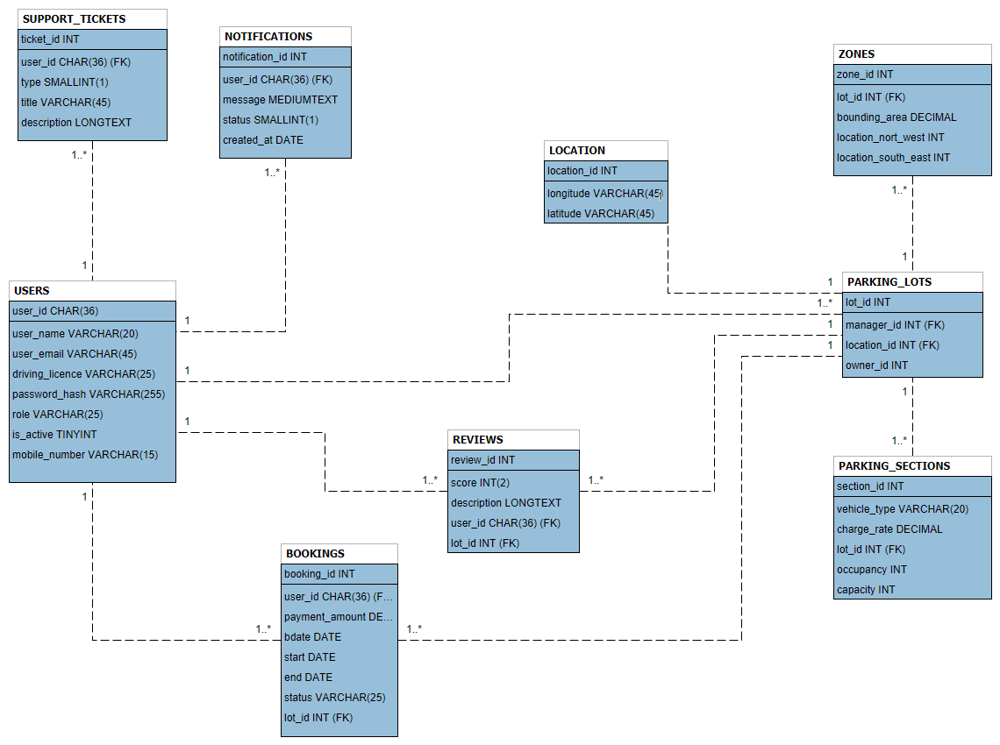

## MySQL Database Implementation

We utilized MySQL as our Relational Database Management System (RDBMS) for this project.

Implemented Entity-Relationship (ER) Diagram:

    
During Docker container creation, the init.sql file is copied to /docker-entrypoint-initdb.d/. This process automatically creates the necessary tables for both the Spring Boot application (within the parkngotest database) and the Node.js application (within the parkngo_mailer_db database).

Although the Spring Boot application employs Hibernate as its Object-Relational Mapper (ORM), we chose to pre-create the tables using init.sql to simplify the insertion of sample data.

[Ideally, sample data should be inserted and used within the database during unit and integration tests.  However, due to time constraints and the incomplete implementation of an ORM (Prisma) in our Node.js application, we opted to manually create and insert data directly into the tables.  We acknowledge this as a less-than-ideal approach and plan to address it in future iterations.]
